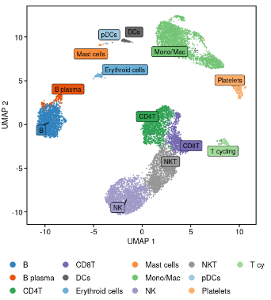
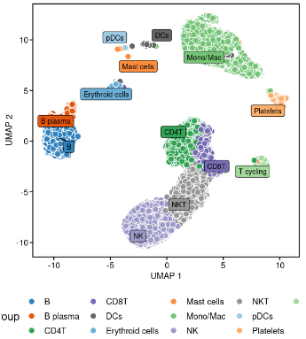

# scMisc

This package is a collection of functions that I have found useful for single cell RNA-seq analysis in Seurat V5. It is a work in progress and I will be adding more functions as I develop them.

## Installation

dependencies:
```r
install.packages(c("devtools", "RColorBrewer", "aplot", "dplyr", "ggplot2", "ggrepel", "magrittr", "paletteer", "patchwork", "reshape2", "stringr", "tibble", "tidydr", "ggpubr"))
```

```r
devtools::install_github("bionoob7/scMisc")
```

## Examples





